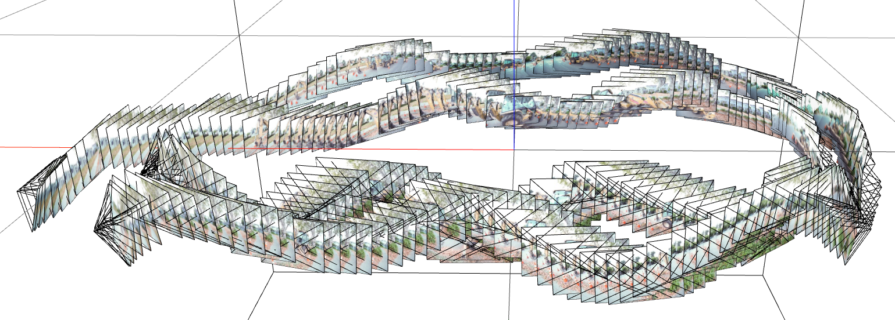

# Nerf Test

## Summary
- Nerf라는 것은 결국 한 객체에 대한 3D 좌표 Position(x, y, z)와 이를 바라보는 방향 벡터 Direction(θ, π)를 입력받아 특정 지점에서 객체를 바라보는 방향, 거리에 따른 density를 출력하는 것. 
(5D Coordinate → Light Field )
- 모델 자체는 간단한 MLP 구조를 채택하며, 좋은 결과를 얻기 위해 입력값들에 대해 positional encoding된 vector들로 변환
- Ray의 coarse smapling과 fine sampling을 결합해 효율을 높였음
- 다만 한 객체에 대해 학습하기 위해 적어도 수백 장의 서로 다른 위치에서 찍은 사진이 필요함.    
        
    - 예를 들어 nerf studio의 길가에 서있는 dozer 객체를 3D화하기 위해 총 323장의 이미지 데이터가 사용되었음
    - 학습 효율을 높이기 위해 게임에서 사용되는 mesh 타입의 데이터를 사용했을 경우, 학습 효율이나 성능이 더 높게 나타남
- 또한 근본적으로 nerf 모델은 수십~수백 장의 이미지 데이터를 통해 3D Map을 구현하는 기술에 가까움
- 이를 실질적으로 응용하는 것은 부동산에서 방을 소개하는 과정에서 사용할 수 있을 것으로 보임

## STEP 01 : Nerf Studio
- 오픈소스로 공개된 Nerf Studio Library와 Demo 코드를 통해 리뷰
- dozer data 323장으로 학습, 렌더링 구현하는 일체 과정 수행
- 이를 위해 python3.7.x 버전과 node.js 버전을 16 이상으로 맞추는 등의 환경설정 필요

## STEP 02 : Kakao brain library